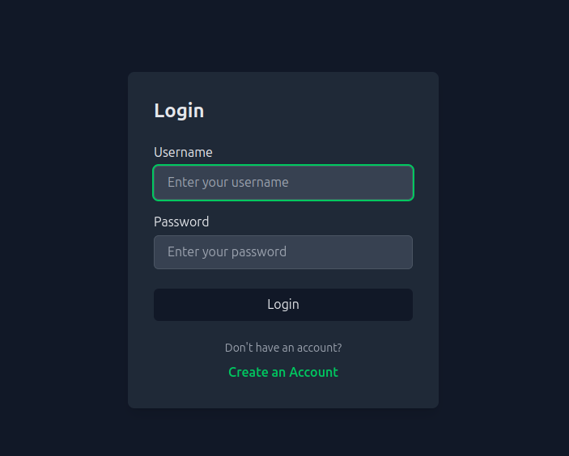
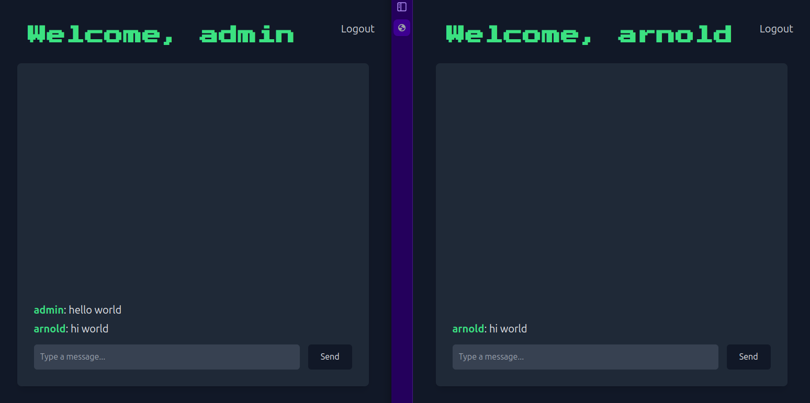
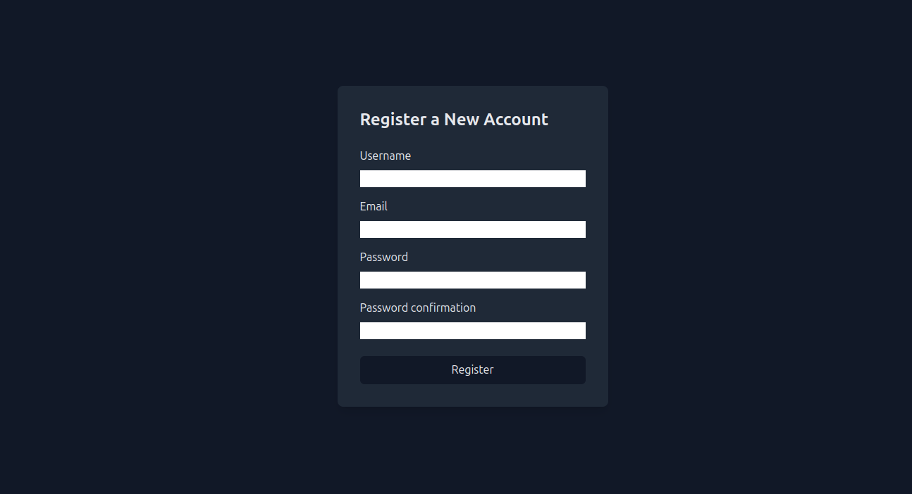

# Django Chat Application 

This is a simple real-time chat application built using Django and Django Channels. It allows multiple users to join a chat room and send/receive messages in real-time via WebSockets.

## Features

- User registration and login.
- Real-time messaging using Django Channels and WebSockets.
- Chat rooms where users can send messages to all connected participants.
- Automatically logs in the user after registration.

## Screenshots 

### Login Page



### Chat Page 



### Registration Page



## Prerequisites

- Python 3.10 or higher
- Django 
- Django Channels
- Daphne (ASGI server)

## Setup Instructions

### 1. Clone the Repository

```bash
git clone https://github.com/binaryash/django-chat-app.git
cd django-chat-app
```

### 2. Create a Virtual Environment

It is recommended to use a virtual environment for the project dependencies.

```bash
python -m venv venv
source venv/bin/activate  # For Windows, use 'venv\Scripts\activate'
```

### 3. Install Dependencies

Install the required Python packages listed in `requirements.txt`.

```bash
pip install -r requirements.txt
```

The `requirements.txt` file includes the following:
- `Django`
- `channels` (for WebSocket support)
- `daphne` (ASGI server)

### 4. Configure Django Settings

In your `settings.py`, ensure you have the following configurations:

- Add `channels` to the `INSTALLED_APPS`:

```python
INSTALLED_APPS = [
    # other apps
    'channels',
]
```

- Set the `ASGI` application:

```python
ASGI_APPLICATION = "your_project_name.asgi.application"
```

### 5. Set Up Daphne as the ASGI Server

Daphne is used as the ASGI server to handle WebSocket connections.

- Install Daphne if you haven't already (it should be in your `requirements.txt`):

```bash
pip install daphne
```

- In your `asgi.py` file, ensure it's configured correctly to handle WebSockets:

```python
import os
from django.core.asgi import get_asgi_application
from channels.routing import ProtocolTypeRouter, URLRouter
from channels.auth import AuthMiddlewareStack

os.environ.setdefault('DJANGO_SETTINGS_MODULE', 'your_project_name.settings')

application = ProtocolTypeRouter({
    "http": get_asgi_application(),
    "websocket": AuthMiddlewareStack(
        URLRouter(
            # Your app's routing
        )
    ),
})
```

### 6. Migrate the Database

Run the following command to set up the database:

```bash
python manage.py migrate
```

### 7. Run the Development Server with Daphne

Start the Daphne server to handle WebSocket connections:

```bash
daphne your_project_name.asgi:application
```

Alternatively, you can use `python manage.py runserver` during development, but Daphne is recommended for WebSocket handling.

### 8. Access the Application

- Navigate to the registration page at `/register/` to create an account.
- After logging in, users will be redirected to the chat room.

## WebSocket Integration

Django Channels enables WebSocket support in this chat application.

- **ChatConsumer**: A WebSocket consumer that handles user connections, messages, and disconnections. It uses Django's Channels layer to broadcast messages to all users in the chat room.
  
### Example:

1. A user sends a message via WebSocket.
2. The message is broadcast to the group using `group_send`.
3. All users in the group receive the message in real-time via the WebSocket connection.

## File Structure

```
django-chat-app/
├── chat/             
│   ├── consumers.py        
│   ├── forms.py              
│   ├── models.py          
│   ├── urls.py              
│   ├── views.py             
│   └── templates/
│       └── chat/
│           ├── chatPage.html 
│           └── registerPage.html 
├── your_project_name/
│   ├── __init__.py
│   ├── asgi.py                
│   └── settings.py           
└── manage.py                  
```

## License

This project is open-source and available under the MIT License.
